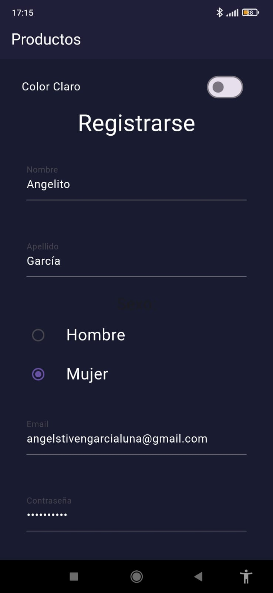
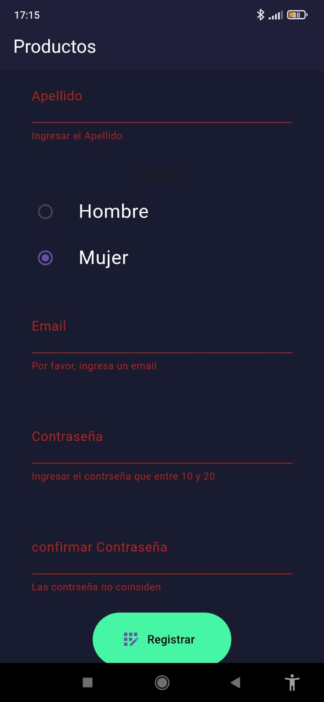

# Evaluacion 2

A new Flutter project.

## Getting Started

This project is a starting point for a Flutter application.

A few resources to get you started if this is your first Flutter project:

- [Lab: Write your first Flutter app](https://docs.flutter.dev/get-started/codelab)
- [Cookbook: Useful Flutter samples](https://docs.flutter.dev/cookbook)

For help getting started with Flutter development, view the
[online documentation](https://docs.flutter.dev/), which offers tutorials,
samples, guidance on mobile development, and a full API reference.

**HOME**

  

**Segunda Página**

  

## Descripción

Esta es una aplicación que incluye un sistema de registro con validaciones. Cuando todos los campos del formulario de registro se han completado correctamente, aparecerá una notificación en forma de burbuja indicando que el registro se ha completado con éxito. Además, el botón ubicado en la parte superior cambiará de color, reflejando el estado exitoso del registro dentro de la aplicación.

## Características Principales

- **Validación de Formulario**: Asegura que todos los campos requeridos sean llenados correctamente antes de permitir el registro del usuario.

- **Notificación de Éxito**: Una vez completado el registro correctamente, se muestra una burbuja de notificación informando al usuario del éxito de la operación.

- **Interfaz Dinámica**: El color del botón ubicado en la parte superior cambia para reflejar que el registro ha sido exitoso, mejorando así la experiencia de usuario y ofreciendo un feedback visual inmediato.

## Capturas de Pantalla

(Aquí puedes incluir algunas capturas de pantalla de tu aplicación para mostrar cómo se ve la interfaz de usuario, el formulario de registro, la notificación de éxito y el cambio de color en el botón de la aplicación.)

## Cómo Empezar

Proporciona instrucciones sobre cómo alguien interesado puede configurar tu proyecto localmente. Por ejemplo:

